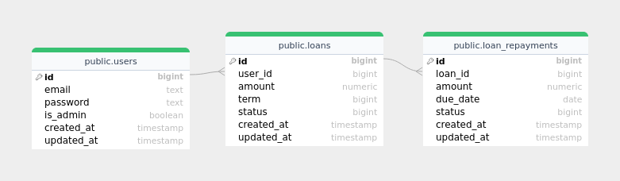

# aspire-lite

This repository contains code for Aspire's take home assignment.

Following features have been built as part of this solution:

* Registering a new user
* User login
* Creating a new loan - Authenticated
* Getting all loans for a user - Authenticated
* Approving a loan - Authenticated & Authorized
* Loan repayment - Authenticated

A high level Entity Relation diagram looks like below:



### Assumptions

During the development of this system, certain assumptions were taken to help with deciding the features. They are listed below:

* There is no concept of interest on the loan taken by the user
* If a user pays more than the required amount for a repayment, the amount for the remaining repayments gets updated based on the total pending amount for the loan.
* If a user repays the entire loan in a (not last) repayment, the remaining repayments are deleted from the system.  

### Hacks / Known Issues

Due to a defined timeline, certain things were hacked around or were not developed with the best possible approach. Some of them are:

* The logs produced by the system are not structured.
* Some corner unit test cases are skipped.
* DB transactions are not used while performing multiple updates in a single API call.

### Running the code

The code can be easily run using docker-compose. Following are some steps:

* Clone the code
* `cd` into the directory and run

  ```docker-compose up --build```

  The code will compile and auto migrate the database

  (There is a possibility of a race condition happening where the code runs before the DB is ready to accept connections. If this happens, simply cancel and re-execute the command)

* Once the code is up and running, visit [http://localhost:8080/swagger/index.html](http://localhost:8080/swagger/index.html) to view the swagger docs and accessing the different APIs.

* Run tests by running

  ```go test ./...```

  from the root directory.